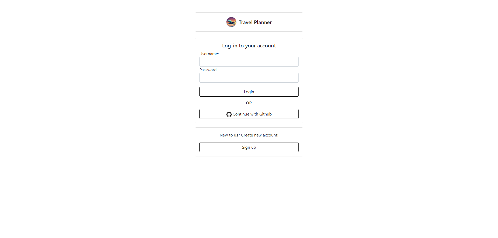
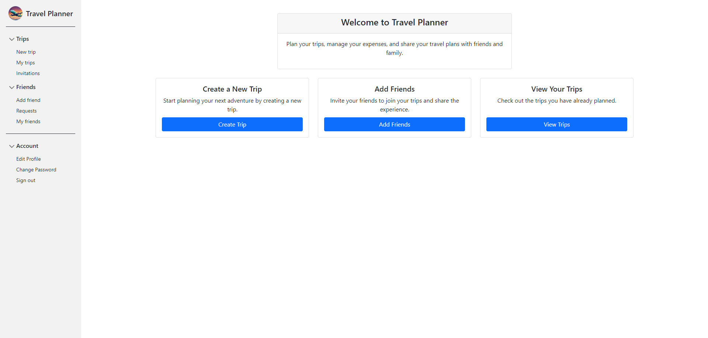
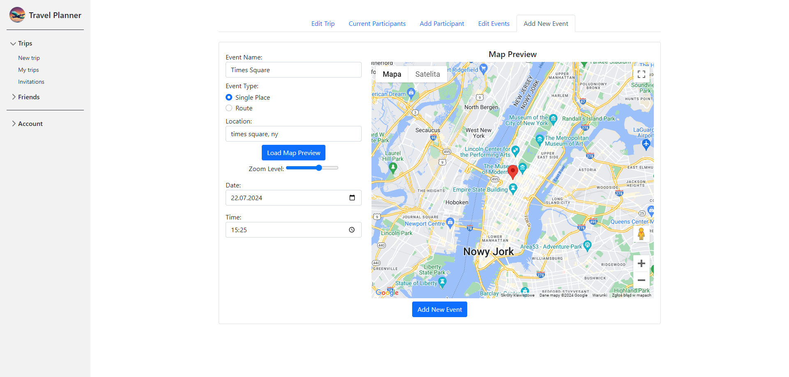
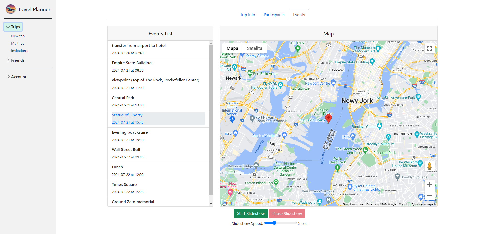
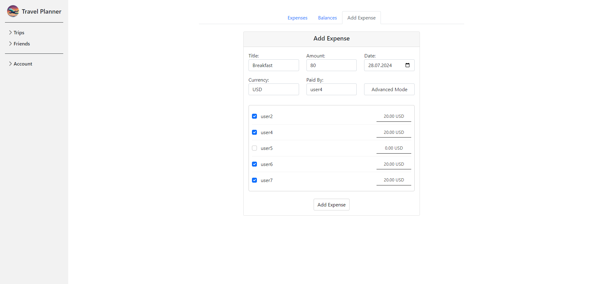
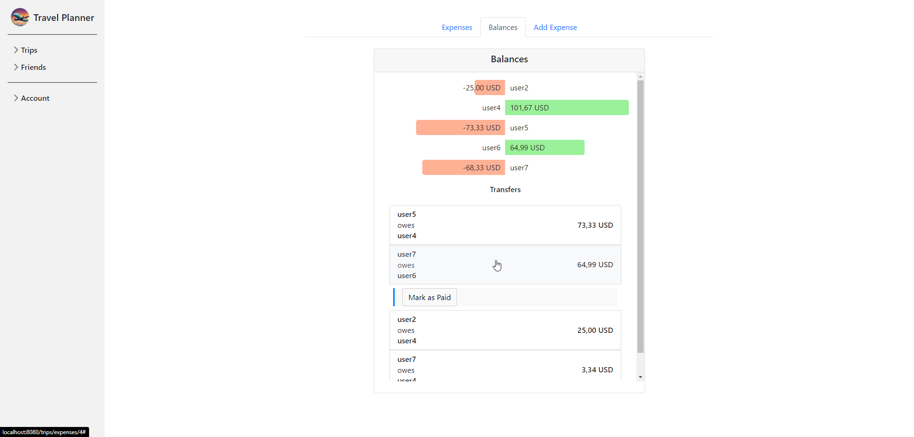
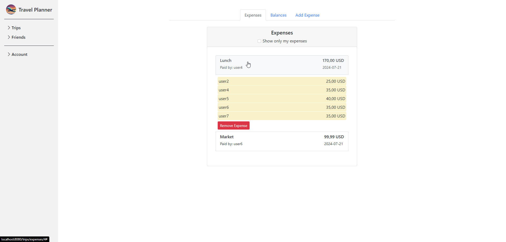

# travel-planner

Travel Planner is web application for planning trips, managing expenses, and sharing travel plans with friends. This was my graduation project (UWr 06.2024).

## Installation

```bash
docker-compose up --build
```

You need proper environment variables in .env file (github client id, github client secret, google maps api key). My github client id and google maps api key are not valid anymore. 


## Screenshots







